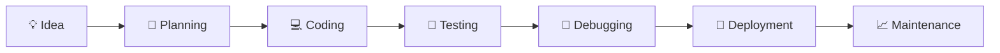

<!-- =======================
        PROFILE BANNER
======================= -->

<p align="center">
  
</p>

<!-- =======================
        HEADER
======================= -->

<h1 align="center">Hi 👋, I'm Sabbir Ahmed</h1>

<h3 align="center">
💻 Software Engineering Student | Python • Java • C++ Developer
</h3>

<!-- =======================
        TYPING ANIMATION
======================= -->

<p align="center">

</p>

---

# 👨‍💻 About Me


🎓 **B.Sc. in Software Engineering**

💻 Passionate about Software Development & Problem Solving

🚀 Currently Building

- 🏠 BREAP (Bangladesh Real Estate AI Platform)
- 🌐 Personal Portfolio Website
- 🤖 AI & Machine Learning Projects

🌱 Currently Learning

- Python
- Java
- React
- Django
- Flutter
- Machine Learning

🎯 Career Goal

> Become a Professional Software Engineer and AI Engineer by building real-world applications that solve meaningful problems.

---

## 🌟 Quick Facts

- 💼 Open to internships and collaborative projects
- 📚 Learning every day through coding and projects
- ⚡ Love creating practical software
- 🌍 Based in Bangladesh

---

<p align="center">


</p>

---


# 💻 Programming Languages

<p align="center">


</p>

---

# 🌐 Frontend Development

<p align="center">


</p>

---

# ⚙️ Backend Development

<p align="center">


</p>

---

# 🗄️ Database

<p align="center">


</p>

---

# 📱 Mobile Development

<p align="center">


</p>

---

# 🤖 AI / Machine Learning

<p align="center">


</p>

---

# ☁️ Cloud & Deployment

<p align="center">


</p>

---

# 🛠️ Tools & Technologies

<p align="center">


</p>

---

# 📚 Currently Learning

```text
🐍 Python                ████████████████████░   90%

☕ Java                  █████████████████░░░   85%

⚛ React                 ██████████████░░░░░░   70%

🎯 Django               █████████████░░░░░░░   65%

📱 Flutter              ███████████░░░░░░░░░   55%

🤖 Machine Learning     █████████░░░░░░░░░░░   45%
```

---

# 🚀 Development Workflow

```text
💡 Idea
   │
   ▼
📝 Planning
   │
   ▼
💻 Coding
   │
   ▼
🧪 Testing
   │
   ▼
🐞 Debugging
   │
   ▼
🚀 Deployment
```

---


# 📊 GitHub Statistics

<p align="center">


</p>

---

# 🔥 GitHub Streak

<p align="center">


</p>

---

# 📈 Contribution Graph

<p align="center">


</p>

---

# 🏆 GitHub Trophies

<p align="center">


</p>

---

# 🚀 Featured Projects

| 🚀 Project | 🛠️ Technology | 📌 Status |
|------------|---------------|-----------|
| 🏠 BREAP | Django • React • AI | 🚧 In Progress |
| 🌐 Portfolio Website | HTML • CSS • JavaScript | 🚧 In Progress |
| 🤖 Home Price Predictor | Python • Machine Learning | 🚧 In Progress |
| 🏦 Banker's Algorithm | C++ | ✅ Completed |
| 📊 DFT Signal Processing | Python | ✅ Completed |
| 📚 Student Management System | C++ | 🔜 Planned |

---

# 📚 Current Learning Roadmap

| Technology | Progress |
|------------|----------|
| 🐍 Python | 🟩🟩🟩🟩🟩🟩🟩🟩🟩⬜ 90% |
| ☕ Java | 🟩🟩🟩🟩🟩🟩🟩🟩⬜⬜ 80% |
| ⚛️ React | 🟩🟩🟩🟩🟩🟩⬜⬜⬜⬜ 60% |
| 🎯 Django | 🟩🟩🟩🟩🟩⬜⬜⬜⬜⬜ 50% |
| 📱 Flutter | 🟩🟩🟩🟩⬜⬜⬜⬜⬜⬜ 40% |
| 🤖 Machine Learning | 🟩🟩🟩⬜⬜⬜⬜⬜⬜⬜ 30% |

---

# 🎯 2026 Goals

✅ Master Python

✅ Master Java

✅ Become a Full Stack Developer

✅ Learn Machine Learning & AI

✅ Complete BREAP Project

✅ Build Android Apps with Flutter

✅ Deploy Real-World Projects

✅ Contribute to Open Source

✅ Reach 1000+ GitHub Contributions

---

# 💡 Quote

<p align="center">

> **"Success doesn't come from what you know. It comes from what you build." 🚀**

</p>

---

# 🐍 GitHub Contribution Snake

<p align="center">
  
</p>

---

# 📫 Contact Me

<p align="center">

<a href="mailto:sabbirahmedstr45@gmail.com">

</a>

<a href="https://www.linkedin.com/in/sabbir-ahmed-75171627a/">

</a>

<a href="https://github.com/Sabbir2110">

</a>

</p>

---

# ❤️ Support Me

<p align="center">

If you like my work, please consider giving ⭐ to my repositories.

</p>

<p align="center">

<a href="https://github.com/Sabbir2110?tab=repositories">

</a>

</p>

---

# 🎯 My Coding Philosophy

```text
✔ Learn Every Day

✔ Build Real Projects

✔ Solve Real Problems

✔ Never Stop Learning

✔ Share Knowledge

✔ Keep Improving
```

---

# 🌟 Developer Quote

<p align="center">

<h3 align="center">
"First, solve the problem.
Then, write the code."
</h3>

<b align="center">
— John Johnson
</b>

</p>

---

# 👀 Visitors

<p align="center">


</p>

---

# ⚡ Fun Fact

```text
💻 I enjoy turning ideas into real-world software.

🚀 Every project teaches me something new.

🌍 Technology is my passion.

🤖 Future AI Engineer.
```

---

<p align="center">


</p>

<h2 align="center">
⭐ Thanks for Visiting My GitHub Profile ⭐
</h2>

<p align="center">
<i>Happy Coding! 🚀</i>
</p>

---

# 📂 Repository Highlights

<div align="center">

| 🚀 Project | ⭐ Status | 🔗 Link |
|------------|-----------|---------|
| 🏠 BREAP - Bangladesh Real Estate AI Platform | 🚧 In Progress | Coming Soon |
| 🌐 Personal Portfolio Website | 🚧 In Progress | Coming Soon |
| 🤖 Home Price Predictor (AI) | 🚧 In Progress | Coming Soon |
| 🏦 Banker's Algorithm | ✅ Completed | Repository |
| 📊 DFT Signal Processing | ✅ Completed | Repository |

</div>

---

# 📈 Coding Activity

<p align="center">


</p>

> **Note:** WakaTime Stats will appear after connecting your WakaTime account.

---

# 🤝 Open Source

💙 I enjoy learning through real-world projects and contributing to open-source whenever possible.

If you'd like to collaborate on software engineering, web development, or AI projects, feel free to reach out.

---

# 📬 Let's Connect

<p align="center">

<a href="mailto:sabbirahmedstr45@gmail.com">

</a>

<a href="https://www.linkedin.com/in/sabbir-ahmed-75171627a/">

</a>

<a href="https://github.com/Sabbir2110">

</a>

</p>

---

# 💡 Favorite Quote

<div align="center">

> **"The best way to predict the future is to build it."**

</div>

---

# 👀 Profile Visitors

<p align="center">


</p>

---

<div align="center">

## 🚀 Thanks for Visiting!

### ⭐ If you like my work, consider following me and starring my repositories.


</div>

---

# 🏅 Achievements

<p align="center">


</p>

---

# 📚 Currently Reading

```text
📖 Clean Code — Robert C. Martin

📖 Design Patterns — GoF

📖 Python Crash Course

📖 Hands-On Machine Learning
```

---

# 🛠 Development Environment

```yaml
OS: Windows 11

Editor: Visual Studio Code

Languages:
  - Python
  - Java
  - C++
  - JavaScript

Frameworks:
  - Django
  - React

Database:
  - MySQL
  - SQLite

Version Control:
  - Git
  - GitHub
```

---

# 🎯 2026 Learning Path

- ✅ Python
- ✅ Java
- 🔄 Django
- 🔄 React
- 🔄 Flutter
- 🔄 Machine Learning
- ⏳ Deep Learning
- ⏳ AWS Cloud
- ⏳ Docker
- ⏳ Kubernetes

---

# 📈 Weekly Coding Goal

| Goal | Status |
|------|--------|
| 💻 Code Every Day | 🔄 |
| 📚 Learn New Technology | 🔄 |
| 🚀 Build Projects | 🔄 |
| 📝 Upload to GitHub | 🔄 |
| 🤝 Contribute to Open Source | 🔄 |

---

# 🌎 Languages I Speak

- 🇧🇩 Bangla (Native)
- 🇺🇸 English (Intermediate)

---

# ☕ Developer Mindset

> **"Code. Learn. Build. Repeat."**

---

<p align="center">


</p>

---

# 🚀 Developer Dashboard

<p align="center">


</p>

<p align="center">


</p>

<p align="center">


</p>

---

# 💻 Coding Profiles

<p align="center">

<a href="https://leetcode.com/">

</a>

<a href="https://codeforces.com/">

</a>

<a href="https://www.hackerrank.com/">

</a>

</p>

---

# 🧩 Tech Stack Overview

```text
Programming     ████████████████████ 90%

Problem Solving ██████████████████░░ 85%

Web Development ████████████████░░░░ 80%

Backend         ██████████████░░░░░░ 70%

Machine Learning██████████░░░░░░░░░░ 50%

Flutter         ████████░░░░░░░░░░░░ 40%
```

---

# 📅 2026 Project Roadmap

- 🏠 BREAP
- 🌐 Portfolio Website
- 🤖 Home Price Predictor
- 📱 Flutter App
- 🧠 Machine Learning Projects
- ☁️ Cloud Deployment
- 🔓 Open Source Contributions

---

# 🌟 Favorite Technologies

<p align="center">


</p>

---

# 📜 Certifications (Coming Soon)

- 🎓 Python Programming
- 🎓 Java Programming
- 🎓 Web Development
- 🎓 Machine Learning
- 🎓 Cloud Computing

---

# 🎯 Motto

<div align="center">

## 🚀 Learn • Build • Share • Improve

</div>

---

# 💬 Quote

<div align="center">

> "Programming isn't about what you know; it's about what you can build through continuous learning."

</div>

---

<p align="center">


</p>

---

# 🎨 Technology Universe

<p align="center">


</p>

---

# ⚡ My Development Workflow



---

# 📊 Tech Journey

| Technology | Status | Level |
|------------|--------|--------|
| 🐍 Python | ✅ Learning | ⭐⭐⭐⭐⭐ |
| ☕ Java | ✅ Learning | ⭐⭐⭐⭐☆ |
| 💙 C++ | ✅ Good | ⭐⭐⭐⭐⭐ |
| 🌐 HTML/CSS | ✅ Good | ⭐⭐⭐⭐☆ |
| ⚡ JavaScript | ✅ Learning | ⭐⭐⭐⭐☆ |
| ⚛ React | 🔄 Learning | ⭐⭐⭐☆☆ |
| 🎯 Django | 🔄 Learning | ⭐⭐⭐☆☆ |
| 📱 Flutter | 🔄 Learning | ⭐⭐☆☆☆ |
| 🤖 Machine Learning | 🔄 Learning | ⭐⭐☆☆☆ |

---

# 💼 Development Environment

```yaml
💻 Laptop:
  OS: Windows 11

🖥 IDE:
  - Visual Studio Code

💾 Version Control:
  - Git
  - GitHub

🐍 Python:
  Version: 3.13.x

☕ Java:
  Version: JDK 25

💙 C++:
  Compiler: GCC 16.x

🛢 Database:
  - MySQL
  - SQLite
```

---

# 📈 My Coding Philosophy

```text
Learn 📚

↓

Practice 💻

↓

Build 🚀

↓

Share 🌍

↓

Repeat 🔁
```

---

# 🌍 Open Source Goals

- ⭐ Contribute to Open Source
- 🚀 Build Real World Projects
- 🤝 Collaborate with Developers
- 📚 Learn New Technologies
- 💡 Solve Real Problems

---

# 🎯 Dream Career

```text
Software Engineer

↓

Full Stack Developer

↓

AI Engineer

↓

Tech Entrepreneur 🚀
```

---

# 🌟 Daily Routine

| 🌞 Time | 📌 Activity |
|---------|------------|
| ☀ Morning | Study New Technologies |
| 💻 Afternoon | Build Projects |
| 🌙 Evening | Solve Programming Problems |
| 🌃 Night | Push Code to GitHub |

---

# ❤️ Thanks for Visiting

<p align="center">

### ⭐ If you like my work, don't forget to Follow me and Star my repositories.

</p>

<p align="center">


</p>

---

---

# 🎓 Education

| Degree | Institution | Status |
|---------|-------------|--------|
| 🎓 B.Sc. in Software Engineering | University | 📖 Ongoing |

---

# 🏅 Certifications

> 🚧 Certifications will be updated soon.

- 🐍 Python Programming
- ☕ Java Programming
- 🌐 Full Stack Web Development
- 🤖 Machine Learning
- ☁️ Cloud Computing

---

# 💼 Experience Timeline

```text
2025 ───────────── Started Programming

2026 ───────────── Learning Python & Java

2026 ───────────── Building BREAP

2026 ───────────── Learning Full Stack Development

2027 ───────────── AI & Machine Learning

Future ─────────── Software Engineer 🚀
```

---

# 🚀 Featured Project Cards

<table>

<tr>

<td width="50%">

<h3 align="center">🏠 BREAP</h3>

<p align="center">

Bangladesh Real Estate AI Platform

<br><br>

Django • React • AI

<br><br>

🚧 In Progress

</p>

</td>

<td width="50%">

<h3 align="center">🌐 Portfolio Website</h3>

<p align="center">

Personal Portfolio

<br><br>

HTML • CSS • JavaScript

<br><br>

🚧 In Progress

</p>

</td>

</tr>

<tr>

<td width="50%">

<h3 align="center">🤖 Home Price Predictor</h3>

<p align="center">

Machine Learning Project

<br><br>

Python • Scikit-learn

<br><br>

🚧 In Progress

</p>

</td>

<td width="50%">

<h3 align="center">🏦 Banker's Algorithm</h3>

<p align="center">

Operating System Project

<br><br>

C++

<br><br>

✅ Completed

</p>

</td>

</tr>

</table>

---

# 📈 Career Roadmap

```text
🎓 Student

↓

💻 Software Developer

↓

🌐 Full Stack Developer

↓

🤖 AI Engineer

↓

🚀 Tech Entrepreneur
```

---

# 🌟 Areas of Interest

- 💻 Software Engineering
- 🌐 Web Development
- 🤖 Artificial Intelligence
- 📊 Machine Learning
- 📱 Mobile App Development
- ☁️ Cloud Computing
- 🛡 Cyber Security
- 🧠 Data Structures & Algorithms

---

# 📚 Current Focus

- 🚀 Building Real-World Projects
- 🐍 Mastering Python
- ☕ Improving Java Skills
- ⚛ Learning React
- 🎯 Learning Django
- 📱 Exploring Flutter
- 🤖 Learning AI & Machine Learning

---

# 📬 Let's Build Something Together

<p align="center">

If you're interested in collaborating on exciting software projects,

feel free to connect with me!

</p>

---

<div align="center">

## ⭐ Keep Learning • Keep Building • Keep Growing 🚀

</div>

---

---

# 🚀 Premium Project Showcase

<div align="center">

| Project | Description | Tech Stack | Status |
|---------|-------------|------------|--------|
| 🏠 BREAP | Bangladesh Real Estate AI Platform | Django • React • AI • MySQL | 🚧 In Progress |
| 🌐 Portfolio Website | Personal Developer Portfolio | HTML • CSS • JavaScript | 🚧 In Progress |
| 🤖 Home Price Predictor | Machine Learning Price Prediction | Python • Scikit-learn | 🚧 In Progress |
| 🏦 Banker's Algorithm | Deadlock Avoidance Algorithm | C++ | ✅ Completed |
| 📊 DFT Signal Processing | Digital Signal Processing | Python | ✅ Completed |
| 📱 Student Management System | Desktop Management App | Java | 🔜 Planned |

</div>

---

# 📂 Featured Repositories

<p align="center">

<a href="https://github.com/Sabbir2110/BREAP">

</a>

<a href="https://github.com/Sabbir2110/Home-Price-Predictor">

</a>

</p>

<p align="center">

<a href="https://github.com/Sabbir2110/Portfolio">

</a>

<a href="https://github.com/Sabbir2110/Bankers-Algorithm">

</a>

</p>

> ⚠️ যদি Repository-এর নাম আলাদা হয়, তাহলে `repo=`-এর মান তোমার আসল Repository নাম অনুযায়ী পরিবর্তন করবে।

---

# 🏆 Project Goals

- ✅ Build Real-World Applications
- ✅ Write Clean & Maintainable Code
- ✅ Follow Best Practices
- ✅ Learn by Building
- ✅ Deploy Full Stack Projects
- ✅ Create AI-Based Solutions

---

# 💻 Development Principles

```text
Think 💡

↓

Design 🎨

↓

Develop 💻

↓

Test 🧪

↓

Deploy 🚀

↓

Maintain 🔧
```

---

# 📊 Coding Progress

| Category | Progress |
|----------|----------|
| Python | ██████████░░ 85% |
| Java | █████████░░░ 80% |
| C++ | ██████████░░ 90% |
| JavaScript | ████████░░░░ 70% |
| React | ██████░░░░░░ 60% |
| Django | ██████░░░░░░ 60% |
| Flutter | ████░░░░░░░░ 40% |
| Machine Learning | ████░░░░░░░░ 40% |

---

# 🌟 Developer Values

- 💙 Clean Code
- 🚀 Continuous Learning
- 🤝 Team Collaboration
- 📚 Knowledge Sharing
- 🎯 Problem Solving
- 🌍 Open Source

---

# 🎯 Long-Term Vision

```text
Software Engineer

↓

Senior Software Engineer

↓

Full Stack Engineer

↓

AI Engineer

↓

Tech Entrepreneur 🚀
```

---

# 💬 Favorite Quote

> **"Great software is built one commit at a time."**

---

<div align="center">

## ⭐ Thank You for Visiting My GitHub Profile!

If you enjoy my projects, consider ⭐ starring my repositories and following my journey.

</div>

---

---

# 🤖 Artificial Intelligence & Machine Learning

<p align="center">


</p>

### 📚 Learning Journey

- 🤖 Machine Learning Fundamentals
- 🧠 Deep Learning
- 📊 Data Analysis
- 📈 Data Visualization
- 🔥 Neural Networks
- 🧮 Mathematics for AI

---

# 💡 Research Interests

- Artificial Intelligence
- Machine Learning
- Deep Learning
- Computer Vision
- Natural Language Processing
- Predictive Analytics

---

# 📊 AI Learning Roadmap

```text
Python
   │
   ▼
NumPy
   │
   ▼
Pandas
   │
   ▼
Matplotlib
   │
   ▼
Scikit-Learn
   │
   ▼
TensorFlow
   │
   ▼
PyTorch
   │
   ▼
Deep Learning
```

---

# 📈 Development Metrics

| Category | Progress |
|----------|----------|
| Problem Solving | ████████████░░ 85% |
| Programming | █████████████░ 90% |
| Web Development | ██████████░░░ 75% |
| AI / ML | █████░░░░░░░░ 40% |
| Database | █████████░░░░ 70% |
| Git & GitHub | ███████████░░ 85% |

---

# 🧩 Software Engineering Principles

✔ Clean Code

✔ SOLID Principles

✔ Object-Oriented Programming

✔ Version Control

✔ Design Patterns

✔ Testing

✔ Documentation

---

# 📚 Books I'm Reading

📖 Clean Code

📖 Python Crash Course

📖 Head First Java

📖 Hands-On Machine Learning

---

# 🌍 Areas I Want to Explore

- Cloud Computing ☁️
- Docker 🐳
- Kubernetes ☸️
- DevOps ⚙️
- Cyber Security 🔐
- Data Science 📊

---

# 💬 Favorite Programming Quote

> "Programs must be written for people to read, and only incidentally for machines to execute."

**— Harold Abelson**

---

# 🚀 Mission

```text
Learn

↓

Build

↓

Deploy

↓

Improve

↓

Repeat
```

---

<p align="center">


</p>

---

---

# 🏆 Competitive Programming

<p align="center">

<a href="https://leetcode.com/">

</a>

<a href="https://codeforces.com/">

</a>

<a href="https://www.hackerrank.com/">

</a>

<a href="https://www.codechef.com/">

</a>

</p>

---

# 📊 Coding Profiles

| Platform | Status |
|----------|--------|
| 💻 GitHub | ✅ Active |
| 🟠 LeetCode | 🚧 Coming Soon |
| 🔵 Codeforces | 🚧 Coming Soon |
| 🟢 HackerRank | 🚧 Coming Soon |
| 🟤 CodeChef | 🚧 Coming Soon |

---

# 📄 Resume

<p align="center">

<a href="#">

</a>

</p>

> Replace `#` with your resume link when available.

---

# 🌐 Portfolio Website

<p align="center">

<a href="#">

</a>

</p>

> Replace `#` with your portfolio website URL.

---

# 🎯 2026 Milestones

- 🏗 Complete BREAP
- 🌐 Launch Portfolio Website
- 📱 Publish Flutter App
- 🤖 Complete ML Projects
- ☁ Deploy on Cloud
- 📚 Learn Advanced Django
- ⚛ Learn Advanced React

---

# 📚 Current Study Plan

```text
Monday      → Python

Tuesday     → Java

Wednesday   → React

Thursday    → Django

Friday      → Machine Learning

Saturday    → Flutter

Sunday      → GitHub + Projects
```

---

# 💻 Coding Habits

```text
☕ Coffee

↓

💡 Idea

↓

⌨️ Code

↓

🐞 Debug

↓

🚀 Push to GitHub

↓

😴 Sleep

↓

🔁 Repeat
```

---

# 🌟 Personal Values

- 💙 Honesty
- 📚 Continuous Learning
- 🤝 Teamwork
- 🚀 Innovation
- 🎯 Discipline
- 🌍 Open Source

---

# 📬 Get In Touch

📧 Email: **sabbirahmedstr45@gmail.com**

🐙 GitHub: **https://github.com/Sabbir2110**

💼 LinkedIn:

**https://www.linkedin.com/in/sabbir-ahmed-75171627a/**

---

<div align="center">

## 🚀 Building Today for a Better Tomorrow

</div>

---

---

# 🌟 Professional Journey

```text
2025
│
├── Started Programming
│
2026
│
├── Learning Python 🐍
├── Learning Java ☕
├── Learning React ⚛️
├── Learning Django 🎯
├── Building BREAP 🏠
│
2027
│
├── AI & Machine Learning 🤖
├── Flutter Development 📱
├── Cloud Deployment ☁️
│
Future
│
└── Software Engineer 🚀
```

---

# 💼 Services I Can Build

| 💻 Service | Status |
|------------|--------|
| 🌐 Portfolio Website | ✅ |
| 🏢 Business Website | 🚧 |
| 🤖 AI Web Application | 🚧 |
| 📊 Machine Learning Project | 🚧 |
| 📱 Flutter App | 🚧 |
| 🔗 REST API | 🚧 |

---

# 🌐 Portfolio

<p align="center">

<a href="#">


</a>

</p>

> Replace **#** with your Portfolio URL after publishing.

---

# 📂 Featured Technologies

<p align="center">


</p>

---

# 📈 GitHub Goals

- ⭐ 500+ GitHub Stars
- 🚀 100+ Repositories
- 💻 1000+ Contributions
- 🌍 Open Source Contributions
- 📚 Continuous Learning

---

# 📖 Currently Exploring

- 🔥 Artificial Intelligence
- 🤖 Machine Learning
- ☁️ Cloud Computing
- ⚛️ React Ecosystem
- 🎯 Django REST Framework
- 📱 Flutter Development

---

# 🎯 Mission Statement

> "To build useful software that helps people and continuously improve as a software engineer."

---

# 🌎 Let's Collaborate

I'm always interested in collaborating on:

- 💻 Open Source Projects
- 🌐 Web Development
- 🤖 AI & Machine Learning
- 📱 Mobile Apps
- 🚀 Innovative Software Ideas

---

# 📬 Contact

<p align="center">

<a href="mailto:sabbirahmedstr45@gmail.com">


</a>

<a href="https://github.com/Sabbir2110">


</a>

<a href="https://www.linkedin.com/in/sabbir-ahmed-75171627a/">


</a>

</p>

---

# ❤️ Support

If you like my work,

⭐ Star my repositories

🍴 Fork my projects

🤝 Follow me on GitHub

💬 Share your feedback

---

<div align="center">

## 🚀 Thanks for Visiting My Profile

### ⭐ Happy Coding! ⭐


</div>

---

---

# 🌍 Developer Principles

<div align="center">

| 💡 Principle | 🚀 Description |
|--------------|----------------|
| 📚 Learn | Learn something new every day |
| 💻 Build | Build real-world projects |
| 🧩 Solve | Solve meaningful problems |
| 🤝 Share | Share knowledge with others |
| 🚀 Improve | Keep improving continuously |

</div>

---

# 💻 My Tech Ecosystem

<p align="center">


</p>

---

# 📅 2026 Learning Timeline

```text
January      ██████████ Python

February     ██████████ Java

March        ██████████ C++

April        ██████████ React

May          ██████████ Django

June         ██████████ Git & GitHub

July         ██████████ Flutter

August       ██████████ Machine Learning

September    ██████████ AI

October      ██████████ Cloud

November     ██████████ Deployment

December     ██████████ Open Source
```

---

# 📊 My Development Cycle

```text
💡 Think

↓

📝 Plan

↓

⌨️ Code

↓

🧪 Test

↓

🐞 Fix Bugs

↓

🚀 Deploy

↓

🔄 Improve

↓

♻ Repeat
```

---

# 🎯 Future Vision

```text
🎓 Graduate

↓

💼 Software Engineer

↓

🌐 Full Stack Engineer

↓

🤖 AI Engineer

↓

🚀 Founder / Entrepreneur
```

---

# 🧠 Soft Skills

- 🤝 Teamwork
- 🗣 Communication
- 💡 Problem Solving
- 📖 Continuous Learning
- ⏳ Time Management
- 🚀 Leadership

---

# 🌐 Find Me Online

<p align="center">

<a href="mailto:sabbirahmedstr45@gmail.com">

</a>

<a href="https://github.com/Sabbir2110">

</a>

<a href="https://www.linkedin.com/in/sabbir-ahmed-75171627a/">

</a>

</p>

---

# ⭐ If You Like My Work

<p align="center">

⭐ Star my repositories

🍴 Fork my projects

👨‍💻 Follow my GitHub journey

🤝 Let's collaborate on amazing ideas!

</p>

---

<div align="center">

## 💙 Thanks for Visiting My GitHub Profile!

### 🚀 Keep Learning • Keep Building • Keep Growing


</div>

---

---

# 🚀 My Vision

<div align="center">

> **"I believe technology can solve real-world problems.  
> My goal is to build impactful software that makes people's lives easier."**

</div>

---

# 🌍 Career Roadmap

```text
🎓 Software Engineering Student
            │
            ▼
💻 Full Stack Developer
            │
            ▼
🤖 AI & Machine Learning Engineer
            │
            ▼
☁ Cloud Engineer
            │
            ▼
🚀 Tech Entrepreneur
```

---

# 📊 GitHub Contribution Philosophy

<div align="center">

💡 Every Commit Matters

🐞 Every Bug Teaches Something

📚 Every Project Builds Experience

🚀 Every Day is a New Opportunity to Learn

</div>

---

# 🧠 Developer Mindset

```text
Think Bigger 💡

        ↓

Plan Carefully 📝

        ↓

Write Clean Code 💻

        ↓

Test Everything 🧪

        ↓

Deploy Confidently 🚀

        ↓

Never Stop Learning 📚
```

---

# ❤️ Why I Love Programming

✔ Solving Real Problems

✔ Building Useful Applications

✔ Learning New Technologies

✔ Open Source Collaboration

✔ Continuous Self Improvement

✔ Turning Ideas Into Reality

---

# 🎯 5-Year Goal

| Year | Goal |
|------|------|
| 2026 | Master Python & Java |
| 2027 | Become Full Stack Developer |
| 2028 | AI & Machine Learning |
| 2029 | Cloud & DevOps |
| 2030 | Professional Software Engineer |

---

# 🌟 Favorite Quote

<div align="center">

## "Code is like humor. When you have to explain it, it's bad."

— Cory House

</div>

---

# 📬 Let's Connect

<p align="center">

<a href="mailto:sabbirahmedstr45@gmail.com">

</a>

<a href="https://github.com/Sabbir2110">

</a>

<a href="https://www.linkedin.com/in/sabbir-ahmed-75171627a/">

</a>

</p>

---

# ☕ Thanks For Visiting

<div align="center">

## ⭐ Thanks for visiting my GitHub Profile!

### If you enjoy my work, consider:

⭐ Following my GitHub

⭐ Starring my repositories

⭐ Connecting with me on LinkedIn

⭐ Collaborating on exciting projects

</div>

---

<p align="center">


</p>

<div align="center">

# 🚀 Happy Coding!

</div>
